# 🚗 AI Car Autofill Service - Architecture Diagram

## System Overview

## Detailed Component Architecture

```mermaid
graph TB
    %% Main Application Components
    subgraph "📱 Main Application"
        MAIN[main.py<br/>Core Processing Logic]
        STREAMLIT[streamlit_app_v2.py<br/>Web Interface]
        RUN[run.py<br/>Startup Script]
        CREATE_INDEX[create_vector_index.py<br/>Vector Index Creation]
    end

    %% Core Functions
    subgraph "🔧 Core Functions"
        EXTRACT[extract_car_info_with_gemini<br/>AI Image Analysis]
        VECTOR_SETUP[setup_faiss_vector_search<br/>Vector Search Setup]
        SEARCH_DB[search_vector_database<br/>FAISS Search]
        MATCH_FORM[match_gemini_extraction_to_form<br/>Form Matching]
        GENERATE_JSON[generate_ikman_form_submission_json<br/>JSON Generation]
        PROCESS_END[process_car_image_end_to_end<br/>End-to-End Processing]
    end

    %% Data Processing
    subgraph "📊 Data Processing"
        NORMALIZE[normalize_text_for_search<br/>Text Normalization]
        ENCODE[encode_image_to_base64<br/>Image Encoding]
        PRELIMINARY[get_preliminary_query<br/>Quick Brand/Model Query]
        MERGE[merge_extracted_data<br/>Multi-Image Merging]
    end

    %% Configuration & Setup
    subgraph "⚙️ Configuration"
        LOAD_ENV[load_env_vars<br/>Environment Variables]
        SETUP_GEMINI[setup_gemini_client<br/>Gemini API Setup]
        CLEAR_CACHE[clear_cached_embeddings<br/>Cache Management]
        AUTO_SETUP[Auto Index Creation<br/>First Run Setup]
    end

    %% Connections
    MAIN --> EXTRACT
    MAIN --> VECTOR_SETUP
    MAIN --> SEARCH_DB
    MAIN --> MATCH_FORM
    MAIN --> GENERATE_JSON
    MAIN --> PROCESS_END
    MAIN --> NORMALIZE
    MAIN --> ENCODE
    MAIN --> PRELIMINARY
    MAIN --> MERGE
    MAIN --> LOAD_ENV
    MAIN --> SETUP_GEMINI
    MAIN --> CLEAR_CACHE
    MAIN --> AUTO_SETUP
    
    STREAMLIT --> MAIN
    RUN --> STREAMLIT
    CREATE_INDEX --> MAIN
```

## Data Flow Sequence

## Vector Search Architecture

## Form Field Mapping Architecture

## Cache Management Architecture

```mermaid
graph TB
    subgraph "💾 Cache Files"
        FAISS_INDEX[faiss_index.bin<br/>~440MB - FAISS Index]
        TFIDF_VECTORIZER[tfidf_vectorizer.pkl<br/>~1MB - TF-IDF Vectorizer]
        FAISS_METADATA[faiss_metadata.pkl<br/>~50MB - Search Metadata]
    end

    subgraph "🔄 Cache Operations"
        LOAD_CACHE[load_saved_faiss_data<br/>Load Cached Data]
        CREATE_CACHE[create_vector_index.py<br/>Generate Cache Files]
        CLEAR_CACHE[clear_cached_embeddings<br/>Remove Cache Files]
        SETUP_CACHE[setup_faiss_vector_search<br/>Cache Setup]
    end

    subgraph "⚡ Performance Benefits"
        FAST_STARTUP[16x Faster Startup<br/>Cached Embeddings]
        PARALLEL_PROC[Parallel Processing<br/>Multiple Images]
        BETTER_UX[Better User Experience<br/>Reduced Loading Time]
    end

    CREATE_CACHE --> FAISS_INDEX
    CREATE_CACHE --> TFIDF_VECTORIZER
    CREATE_CACHE --> FAISS_METADATA
    
    LOAD_CACHE --> FAISS_INDEX
    LOAD_CACHE --> TFIDF_VECTORIZER
    LOAD_CACHE --> FAISS_METADATA
    
    SETUP_CACHE --> LOAD_CACHE
    CLEAR_CACHE --> FAISS_INDEX
    CLEAR_CACHE --> TFIDF_VECTORIZER
    CLEAR_CACHE --> FAISS_METADATA
    
    FAISS_INDEX --> FAST_STARTUP
    TFIDF_VECTORIZER --> FAST_STARTUP
    FAISS_METADATA --> FAST_STARTUP
    
    FAST_STARTUP --> PARALLEL_PROC
    PARALLEL_PROC --> BETTER_UX
```

## Error Handling & Validation

```mermaid
graph TB
    subgraph "❌ Error Scenarios"
        API_ERROR[Gemini API Error<br/>Network/Timeout]
        VECTOR_ERROR[Vector Search Error<br/>Index Not Found]
        JSON_ERROR[JSON Parsing Error<br/>Invalid Response]
        FILE_ERROR[File Upload Error<br/>Invalid Format]
    end

    subgraph "✅ Validation Checks"
        PREREQ_CHECK[Prerequisites Check<br/>Files, Dependencies]
        API_KEY_CHECK[API Key Validation<br/>Gemini API Key]
        VECTOR_CHECK[Vector Index Check<br/>FAISS Index Exists]
        DEPENDENCY_CHECK[Dependency Check<br/>Required Packages]
    end

    subgraph "🔄 Recovery Actions"
        RETRY_MECHANISM[Retry Mechanism<br/>Max 3 Attempts]
        FALLBACK_MATCHING[Fallback Matching<br/>Direct String Matching]
        GRACEFUL_DEGRADATION[Graceful Degradation<br/>Partial Results]
        USER_NOTIFICATION[User Notification<br/>Clear Error Messages]
    end

    API_ERROR --> RETRY_MECHANISM
    VECTOR_ERROR --> FALLBACK_MATCHING
    JSON_ERROR --> GRACEFUL_DEGRADATION
    FILE_ERROR --> USER_NOTIFICATION
    
    PREREQ_CHECK --> API_KEY_CHECK
    API_KEY_CHECK --> VECTOR_CHECK
    VECTOR_CHECK --> DEPENDENCY_CHECK
    
    RETRY_MECHANISM --> USER_NOTIFICATION
    FALLBACK_MATCHING --> USER_NOTIFICATION
    GRACEFUL_DEGRADATION --> USER_NOTIFICATION
```

## Performance Metrics & Optimization

## Technology Stack

```mermaid
graph TB
    subgraph "🤖 AI & ML"
        GEMINI_VISION[Gemini Vision AI<br/>Google AI]
        FAISS[FAISS<br/>Facebook AI Similarity Search]
        TFIDF[TF-IDF Vectorization<br/>scikit-learn]
        FUZZY[Fuzzy String Matching<br/>Custom Algorithm]
    end

    subgraph "🌐 Web Framework"
        STREAMLIT[Streamlit<br/>Web Interface]
        REQUESTS[Requests<br/>HTTP Client]
        PIL[Pillow<br/>Image Processing]
    end

    subgraph "💾 Data Storage"
        JSON[JSON Files<br/>Vector Dataset]
        PICKLE[Pickle Files<br/>Cached Objects]
        BINARY[Binary Files<br/>FAISS Index]
    end

    subgraph "🔧 Development"
        PYTHON[Python 3.8+<br/>Core Language]
        NUMPY[NumPy<br/>Numerical Computing]
        PANDAS[Pandas<br/>Data Manipulation]
    end

    GEMINI_VISION --> FAISS
    FAISS --> TFIDF
    TFIDF --> FUZZY
    
    STREAMLIT --> REQUESTS
    REQUESTS --> PIL
    
    JSON --> PICKLE
    PICKLE --> BINARY
    
    PYTHON --> NUMPY
    NUMPY --> PANDAS
```

This comprehensive architecture diagram shows the complete system design, data flow, and component interactions of the AI Car Autofill Service. The system combines advanced AI vision capabilities with efficient vector search and intelligent form field mapping to provide accurate car information extraction and form autofill functionality. 