# 🚗 AI Car Autofill Service - Architecture Diagram

## System Overview

## Detailed Component Architecture

## Enhanced Data Flow Sequence

## Cost Tracking Architecture

```mermaid
graph TB
    subgraph "💰 Cost Tracking System"
        COST_TRACKER[GeminiCostTracker<br/>Global Instance]
        TIERED_PRICING[Tiered Pricing<br/>Input/Output Tokens]
        IMAGE_COST[Image Cost<br/>$0.0025 per image]
        REQUEST_TRACKING[Request Tracking<br/>Per API Call]
    end

    subgraph "📊 Pricing Tiers"
        INPUT_128K[Input ≤128k tokens<br/>$1.25 per 1M]
        INPUT_ABOVE[Input >128k tokens<br/>$2.50 per 1M]
        OUTPUT_128K[Output ≤128k tokens<br/>$5.00 per 1M]
        OUTPUT_ABOVE[Output >128k tokens<br/>$10.00 per 1M]
    end

    subgraph "🔍 Request Types"
        BRAND_EXTRACTION[Brand Extraction<br/>extract_car_info_with_gemini]
        ADDITIONAL_DETAILS[Additional Details<br/>extract_additional_details_with_gemini]
        PRELIMINARY_QUERY[Preliminary Query<br/>get_preliminary_query]
        BATCH_PROCESSING[Batch Processing<br/>process_car_images_batch]
    end

    subgraph "📈 Cost Analysis"
        TOTAL_COST[Total Cost USD<br/>Real-time Calculation]
        TOKEN_USAGE[Token Usage<br/>Input/Output Breakdown]
        REQUEST_COUNT[Request Count<br/>By Type]
        AVERAGE_COST[Average Cost<br/>Per Request]
    end

    COST_TRACKER --> TIERED_PRICING
    COST_TRACKER --> IMAGE_COST
    COST_TRACKER --> REQUEST_TRACKING
    
    TIERED_PRICING --> INPUT_128K
    TIERED_PRICING --> INPUT_ABOVE
    TIERED_PRICING --> OUTPUT_128K
    TIERED_PRICING --> OUTPUT_ABOVE
    
    REQUEST_TRACKING --> BRAND_EXTRACTION
    REQUEST_TRACKING --> ADDITIONAL_DETAILS
    REQUEST_TRACKING --> PRELIMINARY_QUERY
    REQUEST_TRACKING --> BATCH_PROCESSING
    
    BRAND_EXTRACTION --> TOTAL_COST
    ADDITIONAL_DETAILS --> TOTAL_COST
    PRELIMINARY_QUERY --> TOTAL_COST
    BATCH_PROCESSING --> TOTAL_COST
    
    TOTAL_COST --> TOKEN_USAGE
    TOTAL_COST --> REQUEST_COUNT
    TOTAL_COST --> AVERAGE_COST
```

## Batch Processing Architecture

```mermaid
graph TB
    subgraph "📦 Batch Processing Flow"
        BATCH_INPUT[Multiple Images<br/>Upload/URL]
        BATCH_ENCODE[Encode All Images<br/>Base64 Conversion]
        BATCH_PROMPT[Simplified Prompt<br/>Brand/Model Only]
        BATCH_API[Single API Call<br/>Multiple Images]
        BATCH_PARSE[Parse Results<br/>Per Image]
    end

    subgraph "🔄 Individual Processing"
        VECTOR_SEARCH[Vector Search<br/>Per Image]
        ADDITIONAL_DETAILS[Additional Details<br/>Per Image]
        FORM_GENERATION[Form Generation<br/>Per Image]
        COST_TRACKING[Cost Tracking<br/>Per Image]
    end

    subgraph "⚙️ Optimization Features"
        PARALLEL_WORKERS[Parallel Workers<br/>Max 3 Workers]
        RATE_LIMITING[Rate Limiting<br/>1s Delay Between]
        FALLBACK[Fallback Processing<br/>Individual if Batch Fails]
        COST_EFFICIENCY[Cost Efficiency<br/>Reduced API Overhead]
    end

    subgraph "📊 Batch Benefits"
        REDUCED_OVERHEAD[Reduced API Overhead<br/>Single Request]
        FASTER_PROCESSING[Faster Processing<br/>Parallel Execution]
        LOWER_COSTS[Lower Costs<br/>Efficient Token Usage]
        BETTER_UX[Better UX<br/>Progress Tracking]
    end

    BATCH_INPUT --> BATCH_ENCODE
    BATCH_ENCODE --> BATCH_PROMPT
    BATCH_PROMPT --> BATCH_API
    BATCH_API --> BATCH_PARSE
    
    BATCH_PARSE --> VECTOR_SEARCH
    VECTOR_SEARCH --> ADDITIONAL_DETAILS
    ADDITIONAL_DETAILS --> FORM_GENERATION
    FORM_GENERATION --> COST_TRACKING
    
    BATCH_API --> PARALLEL_WORKERS
    PARALLEL_WORKERS --> RATE_LIMITING
    RATE_LIMITING --> FALLBACK
    FALLBACK --> COST_EFFICIENCY
    
    COST_EFFICIENCY --> REDUCED_OVERHEAD
    REDUCED_OVERHEAD --> FASTER_PROCESSING
    FASTER_PROCESSING --> LOWER_COSTS
    LOWER_COSTS --> BETTER_UX
```

## Vector Search Architecture

## Form Field Mapping Architecture

## Cache Management Architecture

```mermaid
graph TB
    subgraph "💾 Cache Files"
        FAISS_INDEX[faiss_index.bin<br/>~440MB - FAISS Index]
        TFIDF_VECTORIZER[tfidf_vectorizer.pkl<br/>~1MB - TF-IDF Vectorizer]
        FAISS_METADATA[faiss_metadata.pkl<br/>~50MB - Search Metadata]
    end

    subgraph "🔄 Cache Operations"
        LOAD_CACHE[load_saved_faiss_data<br/>Load Cached Data]
        CREATE_CACHE[create_vector_index.py<br/>Generate Cache Files]
        CLEAR_CACHE[clear_cached_embeddings<br/>Remove Cache Files]
        SETUP_CACHE[setup_faiss_vector_search<br/>Cache Setup]
    end

    subgraph "⚡ Performance Benefits"
        FAST_STARTUP[16x Faster Startup<br/>Cached Embeddings]
        PARALLEL_PROC[Parallel Processing<br/>Multiple Images]
        BETTER_UX[Better User Experience<br/>Reduced Loading Time]
    end

    CREATE_CACHE --> FAISS_INDEX
    CREATE_CACHE --> TFIDF_VECTORIZER
    CREATE_CACHE --> FAISS_METADATA
    
    LOAD_CACHE --> FAISS_INDEX
    LOAD_CACHE --> TFIDF_VECTORIZER
    LOAD_CACHE --> FAISS_METADATA
    
    SETUP_CACHE --> LOAD_CACHE
    CLEAR_CACHE --> FAISS_INDEX
    CLEAR_CACHE --> TFIDF_VECTORIZER
    CLEAR_CACHE --> FAISS_METADATA
    
    FAISS_INDEX --> FAST_STARTUP
    TFIDF_VECTORIZER --> FAST_STARTUP
    FAISS_METADATA --> FAST_STARTUP
    
    FAST_STARTUP --> PARALLEL_PROC
    PARALLEL_PROC --> BETTER_UX
```

## Error Handling & Validation

```mermaid
graph TB
    subgraph "❌ Error Scenarios"
        API_ERROR[Gemini API Error<br/>Network/Timeout]
        VECTOR_ERROR[Vector Search Error<br/>Index Not Found]
        JSON_ERROR[JSON Parsing Error<br/>Invalid Response]
        FILE_ERROR[File Upload Error<br/>Invalid Format]
        BATCH_ERROR[Batch Processing Error<br/>Fallback to Individual]
    end

    subgraph "✅ Validation Checks"
        PREREQ_CHECK[Prerequisites Check<br/>Files, Dependencies]
        API_KEY_CHECK[API Key Validation<br/>Gemini API Key]
        VECTOR_CHECK[Vector Index Check<br/>FAISS Index Exists]
        DEPENDENCY_CHECK[Dependency Check<br/>Required Packages]
        COST_LIMIT_CHECK[Cost Limit Check<br/>Budget Monitoring]
    end

    subgraph "🔄 Recovery Actions"
        RETRY_MECHANISM[Retry Mechanism<br/>Max 3 Attempts]
        FALLBACK_MATCHING[Fallback Matching<br/>Direct String Matching]
        GRACEFUL_DEGRADATION[Graceful Degradation<br/>Partial Results]
        USER_NOTIFICATION[User Notification<br/>Clear Error Messages]
        BATCH_FALLBACK[Batch Fallback<br/>Individual Processing]
    end

    API_ERROR --> RETRY_MECHANISM
    VECTOR_ERROR --> FALLBACK_MATCHING
    JSON_ERROR --> GRACEFUL_DEGRADATION
    FILE_ERROR --> USER_NOTIFICATION
    BATCH_ERROR --> BATCH_FALLBACK
    
    PREREQ_CHECK --> API_KEY_CHECK
    API_KEY_CHECK --> VECTOR_CHECK
    VECTOR_CHECK --> DEPENDENCY_CHECK
    DEPENDENCY_CHECK --> COST_LIMIT_CHECK
    
    RETRY_MECHANISM --> USER_NOTIFICATION
    FALLBACK_MATCHING --> USER_NOTIFICATION
    GRACEFUL_DEGRADATION --> USER_NOTIFICATION
    BATCH_FALLBACK --> USER_NOTIFICATION
```

## Performance Metrics & Optimization

## Technology Stack

This comprehensive architecture diagram shows the complete system design, data flow, and component interactions of the AI Car Autofill Service. The system combines advanced AI vision capabilities with efficient vector search, intelligent form field mapping, cost tracking, and batch processing to provide accurate car information extraction and form autofill functionality. 